# TÀI LIỆU THIẾT KẾ KIẾN TRÚC & BIỂU ĐỒ HỆ THỐNG NEXTPHONE (ECOMMERCE)

> **Dự án**: Sàn Thương Mại Điện Tử Thiết Bị Di Động & Phụ Kiện NextPhone  
> **Kiến trúc**: 3-Tier Architecture (.NET 10 Web API + Entity Framework Core + SQL Server + React 18 / TypeScript / Tailwind CSS)  
> **Ngày cập nhật**: 2026-10-02  

---

## MỤC LỤC
1. [TỔNG QUAN HỆ THỐNG & CÁC TÁC NHÂN (ACTORS)](#1-tổng-quan-hệ-thống--các-tác-nhân-actors)
2. [PHẦN 1: CÁC BIỂU ĐỒ USE CASE CHÍNH](#phần-1-các-biểu-đồ-use-case-chính)
   - [2.1. Biểu đồ Use Case Tổng Quan Toàn Hệ Thống](#21-biểu-đồ-use-case-tổng-quan-toàn-hệ-thống)
   - [2.2. Biểu đồ Use Case Phân Hệ Khách Hàng (Customer & Guest Subsystem)](#22-biểu-đồ-use-case-phân-hệ-khách-hàng-customer--guest-subsystem)
   - [2.3. Biểu đồ Use Case Phân Hệ Quản Trị & Người Bán (Admin & Seller Subsystem)](#23-biểu-đồ-use-case-phân-hệ-quản-trị--người-bán-admin--seller-subsystem)
3. [PHẦN 2: CÁC BIỂU ĐỒ SEQUENCE (TUẦN TỰ NGHIỆP VỤ)](#phần-2-các-biểu-đồ-sequence-tuần-tự-nghiệp-vụ)
   - [3.1. Sequence: Đăng Ký, Đăng Nhập & Cấp Phát JWT Bearer Token](#31-sequence-đăng-ký-đăng-nhập--cấp-phát-jwt-bearer-token)
   - [3.2. Sequence: Quy Trình Đặt Hàng & Kiểm Soát Nghiệp Vụ Chặt Chẽ](#32-sequence-quy-trình-đặt-hàng--kiểm-soát-nghiệp-vụ-chặt-chẽ)
   - [3.3. Sequence: Thanh Toán Trực Tuyến VietQR & Xác Nhận Webhook](#33-sequence-thanh-toán-trực-tuyến-vietqr--xác-nhận-webhook)
   - [3.4. Sequence: Thanh Toán Thẻ Tín Dụng Quốc Tế & Xác Thực OTP 3D-Secure](#34-sequence-thanh-toán-thẻ-tín-dụng-quốc-tế--xác-thực-otp-3d-secure)
   - [3.5. Sequence: Xử Lý Đơn Hàng & Tự Động Hoàn Trả Tồn Kho Khi Hủy Đơn](#35-sequence-xử-lý-đơn-hàng--tự-động-hoàn-trả-tồn-kho-khi-hủy-đơn)
   - [3.6. Sequence: Kiểm Duyệt Đánh Giá Sản Phẩm Do AI Gắn Cờ Vi Phạm](#36-sequence-kiểm-duyệt-đánh-giá-sản-phẩm-do-ai-gắn-cờ-vi-phạm)
4. [PHẦN 3: CÁC BIỂU ĐỒ LỚP (CLASS DIAGRAMS)](#phần-3-các-biểu-đồ-lớp-class-diagrams)
   - [4.1. Biểu Đồ Lớp Thực Thể CSDL (Domain Entity Model)](#41-biểu-đồ-lớp-thực-thể-csdl-domain-entity-model)
   - [4.2. Biểu Đồ Lớp Kiến Trúc 3 Tầng (3-Tier Layered Architecture)](#42-biểu-đồ-lớp-kiến-trúc-3-tầng-3-tier-layered-architecture)

---

## 1. TỔNG QUAN HỆ THỐNG & CÁC TÁC NHÂN (ACTORS)

Hệ thống NextPhone phục vụ các tác nhân chính sau:

| Tác Nhân (Actor) | Mô Tả Vai Trò | Phạm Vi Quyền Hạn |
|---|---|---|
| **Khách Vãng Lai (Guest)** | Người dùng chưa đăng nhập tài khoản | Duyệt sản phẩm, tra cứu tin tức, tìm kiếm, tra cứu đơn hàng công khai (bị che dữ liệu riêng tư). |
| **Khách Hàng (Customer)** | Người dùng đã đăng ký & đăng nhập | Quản lý giỏ hàng, đặt hàng, áp mã giảm giá, thanh toán trực tuyến, đánh giá sản phẩm, quản lý điểm Smember. |
| **Quản Trị Viên (Admin/Seller)** | Chủ sàn kiêm đơn vị cung cấp hàng hóa | Quản lý sản phẩm, giám sát xuất nhập kho, tiếp nhận và điều phối vận chuyển, duyệt báo cáo kinh doanh, kiểm duyệt đánh giá AI. *(Bị chặn tuyệt đối không được mua hàng trên sàn)*. |
| **Hệ Thống Ngoài (External Services)** | Cổng thanh toán (VietQR, Ngân hàng, Visa/MasterCard) và Dịch vụ AI (Google Gemini / Content Moderation AI) | Sinh mã QR thanh toán, gửi Webhook xác nhận giao dịch ngân hàng, phân tích nội dung đánh giá gắn cờ tiêu chuẩn cộng đồng. |

---

## PHẦN 1: CÁC BIỂU ĐỒ USE CASE CHÍNH

### 2.1. Biểu đồ Use Case Tổng Quan Toàn Hệ Thống

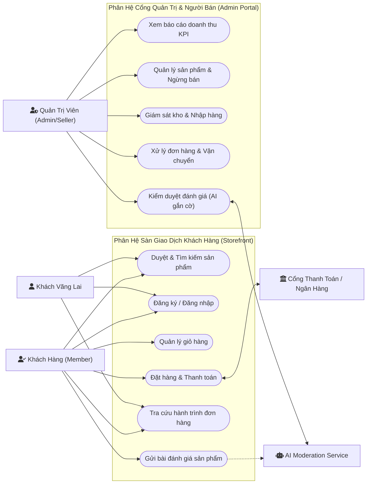

---

### 2.2. Biểu đồ Use Case Phân Hệ Khách Hàng (Customer & Guest Subsystem)

```mermaid
flowchart TB
    %% Actors
    ActorCust["Khách Hàng (Customer)"]
    ActorGuest["Khách Vãng Lai (Guest)"]

    subgraph CustomerUseCases ["Use Cases - Mua Sắm & Tài Khoản"]
        UC_Register(["Đăng ký tài khoản mới"])
        UC_Login(["Đăng nhập hệ thống"])
        UC_Profile(["Cập nhật hồ sơ & Đổi mật khẩu"])
        UC_Smember(["Xem tích điểm & Hạng Smember"])

        UC_ViewDetail(["Xem chi tiết cấu hình & Giá"])
        UC_AddToCart(["Thêm sản phẩm vào giỏ"])
        UC_ApplyCoupon(["Nhập mã khuyến mại (Coupon)"])
        UC_PlaceOrder(["Xác nhận đặt hàng"])
        
        UC_PayCOD(["Thanh toán khi nhận hàng (COD)"])
        UC_PayQR(["Chuyển khoản VietQR Online"])
        UC_PayCard(["Thanh toán Thẻ tín dụng quốc tế"])
        
        UC_OrderHistory(["Xem lịch sử đơn mua"])
        UC_PublicTrack(["Tra cứu đơn hàng bằng Mã (NP-XXXXXX)"])
        UC_WriteReview(["Viết bình luận & Đánh giá sao"])
    end

    %% Guest actions
    ActorGuest --> UC_Register
    ActorGuest --> UC_Login
    ActorGuest --> UC_ViewDetail
    ActorGuest --> UC_PublicTrack

    %% Customer inheritance
    ActorCust --> UC_Profile
    ActorCust --> UC_Smember
    ActorCust --> UC_ViewDetail
    ActorCust --> UC_AddToCart
    ActorCust --> UC_PlaceOrder
    ActorCust --> UC_OrderHistory
    ActorCust --> UC_WriteReview

    %% Includes & Extends
    UC_AddToCart -.->|<<extend>>| UC_Login
    UC_PlaceOrder -.->|<<include>>| UC_ApplyCoupon
    UC_PlaceOrder -.->|<<include>>| UC_PayCOD
    UC_PlaceOrder -.->|<<extend>>| UC_PayQR
    UC_PlaceOrder -.->|<<extend>>| UC_PayCard
```

---

### 2.3. Biểu đồ Use Case Phân Hệ Quản Trị & Người Bán (Admin & Seller Subsystem)

```mermaid
flowchart TB
    %% Actor
    ActorAdmin["Quản Trị Viên / Người Bán (Admin)"]

    subgraph AdminUseCases ["Use Cases - Quản Trị & Vận Hành Sàn"]
        UC_AdminLogin(["Đăng nhập quyền Admin (RBAC)"])

        %% Module 1
        UC_ViewStats(["Xem thống kê KPI & Doanh thu 7 ngày"])
        UC_ExportReport(["Xuất file báo cáo kinh doanh CSV"])

        %% Module 2
        UC_AddProduct(["Thêm mới sản phẩm & Biến thể"])
        UC_EditProduct(["Sửa giá bán, mô tả, thông số"])
        UC_ToggleSale(["Chuyển trạng thái Đang bán / Ngừng bán"])
        UC_DeleteProduct(["Gỡ sản phẩm khỏi sàn"])

        %% Module 3
        UC_LowStockAlert(["Nhận cảnh báo tồn kho sắp cạn"])
        UC_ViewInventoryLogs(["Xem nhật ký xuất / nhập kho"])
        UC_ImportStock(["Lập phiếu nhập thêm hàng vào kho"])

        %% Module 4
        UC_ProcessOrders(["Xem danh sách đơn đặt hàng"])
        UC_UpdateOrderStatus(["Cập nhật tiến độ vận chuyển"])
        UC_CancelOrder(["Hủy đơn & Tự động hoàn kho"])

        %% Module 5
        UC_AiFlaggedReview(["Xem danh sách đánh giá vi phạm AI"])
        UC_ApproveReview(["Phê duyệt hiển thị lại"])
        UC_RejectReview(["Xóa bỏ đánh giá vi phạm"])
        UC_ReplyReview(["Gửi phản hồi chính thức từ Admin"])
    end

    %% Connections
    ActorAdmin --> UC_AdminLogin
    UC_AdminLogin -.->|<<include>>| UC_ViewStats
    UC_ViewStats -.->|<<extend>>| UC_ExportReport

    ActorAdmin --> UC_AddProduct
    ActorAdmin --> UC_EditProduct
    ActorAdmin --> UC_ToggleSale
    ActorAdmin --> UC_DeleteProduct

    ActorAdmin --> UC_LowStockAlert
    ActorAdmin --> UC_ViewInventoryLogs
    ActorAdmin --> UC_ImportStock

    ActorAdmin --> UC_ProcessOrders
    UC_ProcessOrders -.->|<<include>>| UC_UpdateOrderStatus
    UC_UpdateOrderStatus -.->|<<extend>>| UC_CancelOrder

    ActorAdmin --> UC_AiFlaggedReview
    UC_AiFlaggedReview -.->|<<extend>>| UC_ApproveReview
    UC_AiFlaggedReview -.->|<<extend>>| UC_RejectReview
    UC_AiFlaggedReview -.->|<<extend>>| UC_ReplyReview
```

---

## PHẦN 2: CÁC BIỂU ĐỒ SEQUENCE (TUẦN TỰ NGHIỆP VỤ)

### 3.1. Sequence: Đăng Ký, Đăng Nhập & Cấp Phát JWT Bearer Token

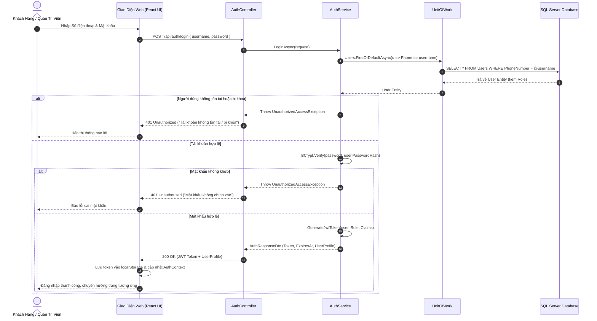

---

### 3.2. Sequence: Quy Trình Đặt Hàng & Kiểm Soát Nghiệp Vụ Chặt Chẽ

Biểu đồ này mô tả chi tiết các chốt chặn nghiệp vụ đã được hoàn thiện: **Chặn Admin mua hàng**, **Chặn thao túng giá**, **Kiểm tra tồn kho chống bán âm**, **Áp dụng Coupon**, và **Giao dịch Database Transaction an toàn**.

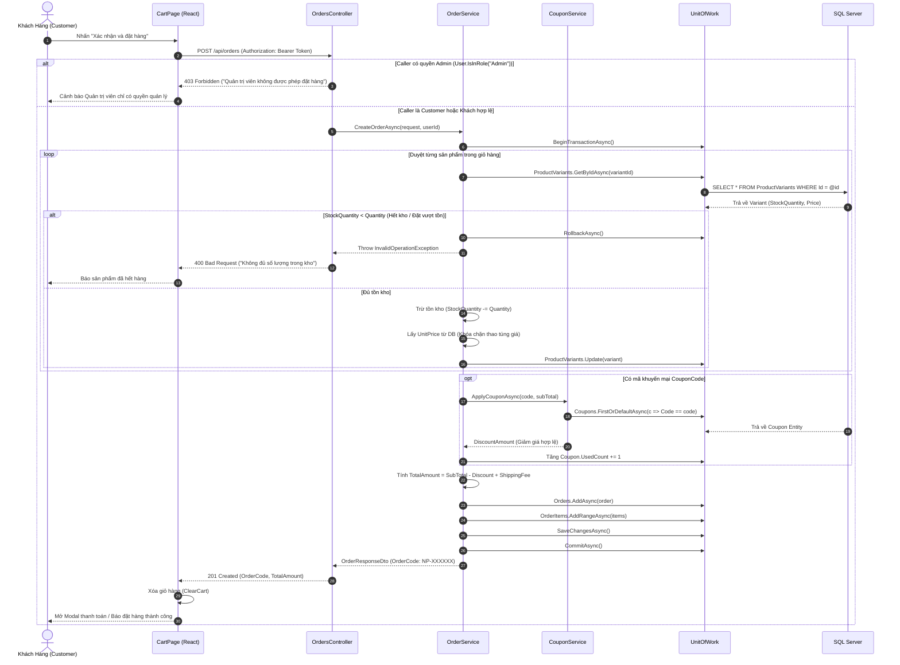

---

### 3.3. Sequence: Thanh Toán Trực Tuyến VietQR & Xác Nhận Webhook

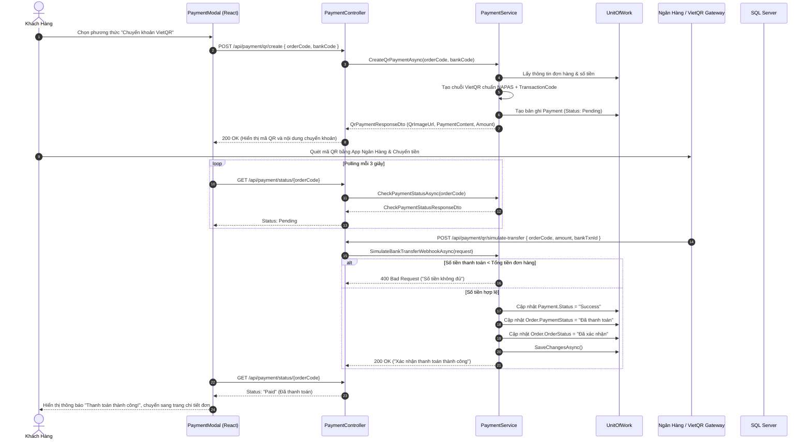

---

### 3.4. Sequence: Thanh Toán Thẻ Tín Dụng Quốc Tế & Xác Thực OTP 3D-Secure

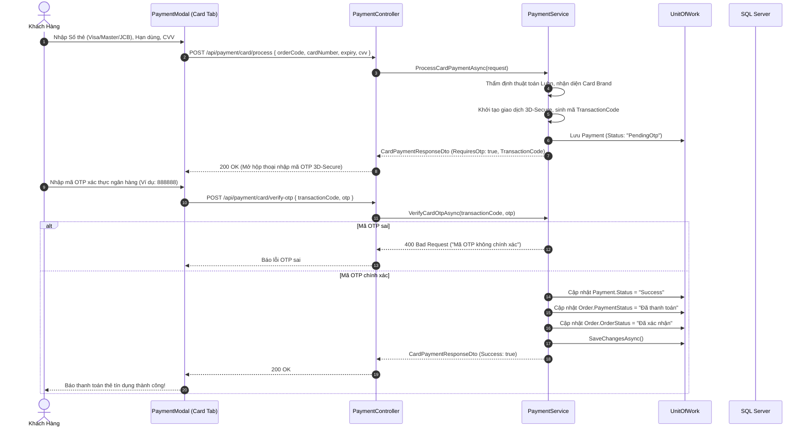

---

### 3.5. Sequence: Xử Lý Đơn Hàng & Tự Động Hoàn Trả Tồn Kho Khi Hủy Đơn

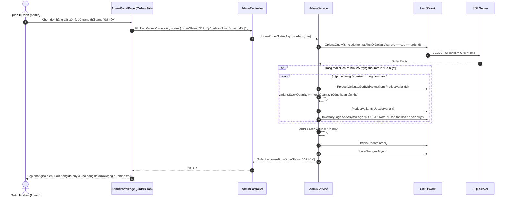

---

### 3.6. Sequence: Kiểm Duyệt Đánh Giá Sản Phẩm Do AI Gắn Cờ Vi Phạm

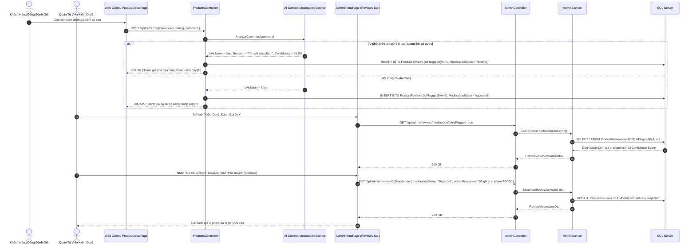

---

## PHẦN 3: CÁC BIỂU ĐỒ LỚP (CLASS DIAGRAMS)

### 4.1. Biểu Đồ Lớp Thực Thể CSDL (Domain Entity Model)

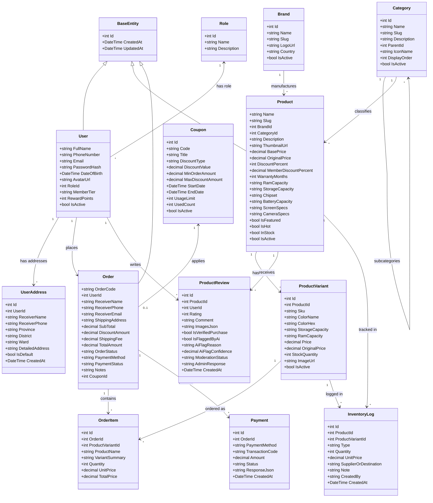

---

### 4.2. Biểu Đồ Lớp Kiến Trúc 3 Tầng (3-Tier Layered Architecture)

Biểu đồ dưới đây mô tả sự phân tách rõ ràng giữa **Presentation Layer (Controllers)**, **Business Logic Layer (Services)** và **Data Access Layer (UnitOfWork & Repository)** theo mẫu thiết kế Dependency Injection.

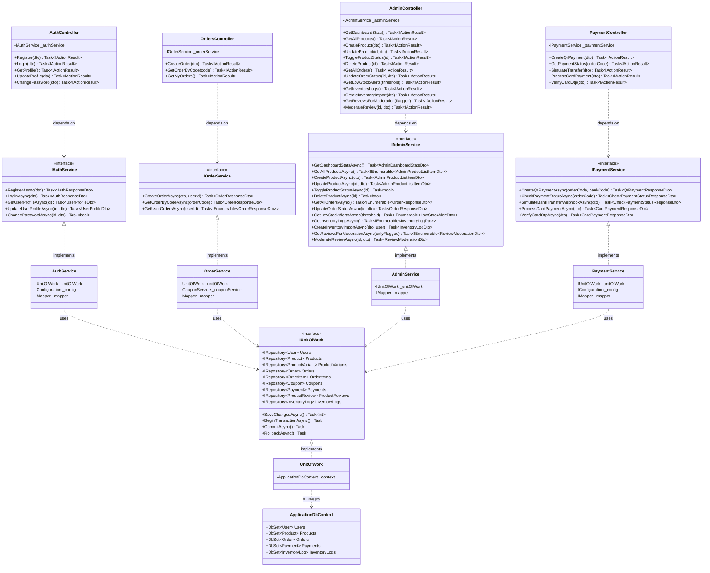

---

## 5. TỔNG KẾT & HƯỚNG DẪN SỬ DỤNG
- Tập tin Markdown này chứa toàn bộ các biểu đồ chuẩn UML được diễn giải bằng cú pháp Mermaid tương thích 100% với GitHub, GitLab, VS Code Markdown Preview, và Antigravity Markdown Viewer.
- Các biểu đồ đã phản ánh chính xác cấu trúc thực tế của mã nguồn hiện tại trong repository:
  1. Phân quyền chặt chẽ `[Authorize(Roles = "Admin")]` cho Kênh Quản trị.
  2. Cơ chế khóa chống thao túng giá bán và kiểm tra tồn kho chống bán âm khi tạo đơn.
  3. Cơ chế tự động hoàn trả tồn kho và ghi nhật ký kiểm kê khi hủy đơn hàng.
  4. Hai cổng thanh toán trực tuyến VietQR (NAPAS 24/7) và Thẻ tín dụng quốc tế (OTP 3D-Secure).
  5. Cơ chế che giấu dữ liệu cá nhân (Data Masking) chống tấn công IDOR khi tra cứu đơn hàng công khai.
