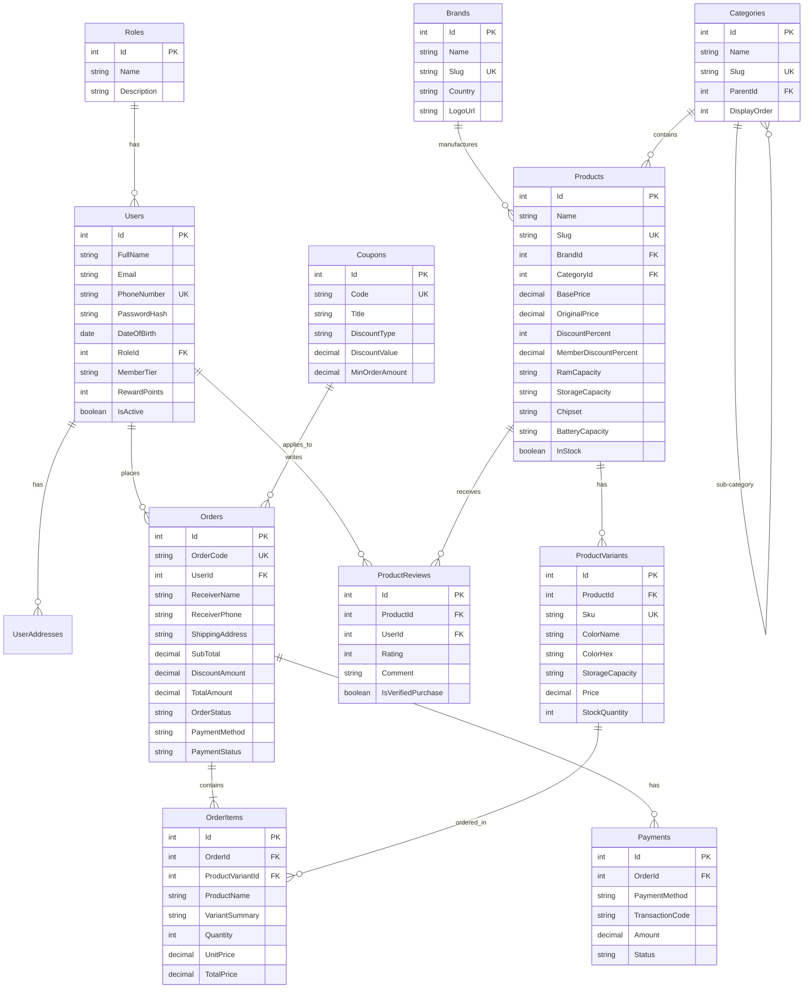

# Sơ Đồ Thiết Kế Cơ Sở Dữ Liệu: NextPhoneDb (Entity-Relationship Diagram)

Hệ thống cơ sở dữ liệu quan hệ được thiết kế chuẩn hóa cho nền tảng thương mại điện tử công nghệ, tối ưu hóa cho mô hình N-Tier của ASP.NET Core và SQL Server.

---

## 📊 Sơ Đồ Quan Hệ Thực Thể (Mermaid ERD)

---

## 🗄️ Bảng Tóm Tắt Chức Năng Các Bảng

| Tên Bảng | Mục Đích Sử Dụng | Các Khóa Ngoại (Foreign Keys) |
| :--- | :--- | :--- |
| **`Roles`** | Quản lý vai trò người dùng (Admin, Customer, Staff) | Không có |
| **`Users`** | Quản lý hội viên NextPhone Member (SĐT, Email, điểm thưởng, hạng thẻ) | `RoleId` $\rightarrow$ `Roles(Id)` |
| **`UserAddresses`** | Sổ địa chỉ nhận hàng của khách hàng | `UserId` $\rightarrow$ `Users(Id)` |
| **`Brands`** | Danh sách hãng công nghệ (Apple, Samsung, Xiaomi, OPPO, Anker...) | Không có |
| **`Categories`** | Danh mục đa cấp (Điện thoại, Laptop, Phụ kiện...) | `ParentId` $\rightarrow$ `Categories(Id)` |
| **`Products`** | Thông tin sản phẩm chính, giá gốc, giá KM, cấu hình tóm tắt | `BrandId`, `CategoryId` |
| **`ProductVariants`**| Biến thể chi tiết theo màu sắc, bộ nhớ, SKU, tồn kho thực tế | `ProductId` $\rightarrow$ `Products(Id)` |
| **`Coupons`** | Mã khuyến mãi, voucher 100K cho thành viên mới, ưu đãi EDU | Không có |
| **`Orders`** | Đơn đặt hàng, thông tin giao nhận, trạng thái vận chuyển | `UserId`, `CouponId` |
| **`OrderItems`** | Từng mặt hàng cụ thể trong giỏ của đơn hàng | `OrderId`, `ProductVariantId` |
| **`Payments`** | Lịch sử giao dịch thanh toán (VNPay, MoMo, COD, Stripe) | `OrderId` $\rightarrow$ `Orders(Id)` |
| **`ProductReviews`**| Đánh giá sao (1-5) và bình luận trải nghiệm của khách | `ProductId`, `UserId` |

